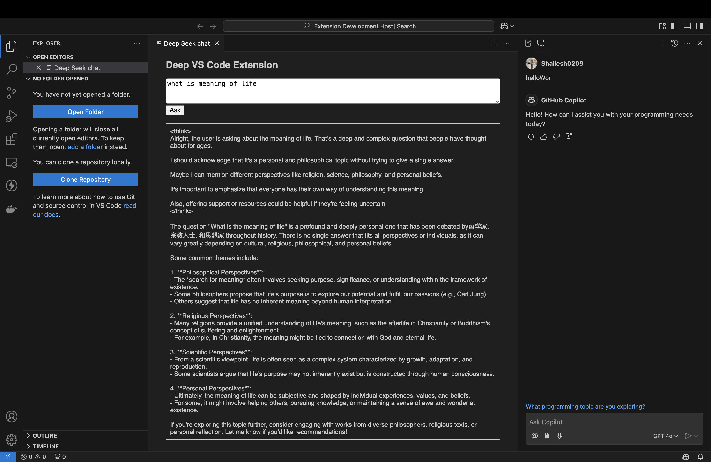

Here's a well-structured `README.md` file for your VS Code extension. It includes installation, usage, troubleshooting, and contribution guidelines. 🚀

---

### 📄 **README.md - DeepSeek Chat VS Code Extension**




```markdown
# DeepSeek Chat - VS Code Extension

A **VS Code extension** that provides a chat interface to communicate with **DeepSeek AI** using the **Ollama API**. This extension enables developers to query DeepSeek AI directly from the VS Code editor.

## ✨ Features
- Opens a webview panel for interactive chat.
- Sends queries to the **DeepSeek AI** model via the **Ollama API**.
- Streams responses directly into the chat window.
- Works locally with **Ollama running on Mac**.

---

## 🚀 Installation

### 1️⃣ Clone the Repository
```sh
git clone https://github.com/your-username/deepseek-vscode-extension.git
cd deepseek-vscode-extension
```

### 2️⃣ Install Dependencies
```sh
npm install
```

### 3️⃣ Start Ollama on Your Machine
Ensure that **Ollama is running** before using the extension. Run:
```sh
ollama serve
```

Check if the API is running:
```sh
curl http://localhost:11434/api/generate -X POST -H "Content-Type: application/json" -d '{"model":"deepseek-r1", "prompt":"Hello"}'
```
If you get a response, the API is working.

### 4️⃣ Run the Extension in Debug Mode
1. Open the project in **VS Code**.
2. Press `F5` to start the extension in a **new Extension Development Host**.
3. Open the **Command Palette** (`Ctrl+Shift+P` or `Cmd+Shift+P` on Mac).
4. Search for **"Chat with DeepSeek"** and select it.

---

## 🔧 Usage

1. Open the **Command Palette** (`Ctrl+Shift+P`).
2. Type **"Chat with DeepSeek"** and select it.
3. A webview will appear with a text area and a button.
4. Type your query and click **"Ask"**.
5. The response will be displayed in the chat window.

---

## 🛠️ Troubleshooting

### ❌ `Error: TypeError: fetch failed`
✔ **Solution:** Ensure that **Ollama is running** by executing:
```sh
ollama serve
```
Then test the API:
```sh
curl http://localhost:11434/api/generate -X POST -H "Content-Type: application/json" -d '{"model":"deepseek-r1", "prompt":"Hello"}'
```
If this fails, restart Ollama.

### ❌ "Command 'Chat with DeepSeek' not found"
✔ **Solution:** Make sure the command in `package.json` matches the registered command in `activate()`:
```json
"contributes": {
  "commands": [
    {
      "command": "fireship-ext.start",
      "title": "Chat with DeepSeek"
    }
  ]
}
```
✔ Restart VS Code and try again.

### ❌ Webview panel does not load
✔ **Solution:** Open **Developer Tools** (`Help` → `Toggle Developer Tools`) and check for errors.

---

## 🏗️ Development

### 🛠️ Prerequisites
- **Node.js & npm** installed
- **Visual Studio Code**
- **Ollama** installed and running

### 🔨 Build & Run
1. **Install dependencies**:
   ```sh
   npm install
   ```
2. **Start debugging**:
   ```sh
   F5
   ```
3. Test the extension in the **Extension Development Host**.

---

## 🤝 Contributing
1. Fork the repository.
2. Create a new branch: `feature-new-functionality`.
3. Commit your changes: `git commit -m "Add new feature"`.
4. Push to the branch: `git push origin feature-new-functionality`.
5. Open a **Pull Request**.

---

## 📜 License
This project is licensed under the **MIT License**.

---

## 🌟 Acknowledgments
- **Ollama** for local AI models.
- **VS Code API** for making extensions possible.
